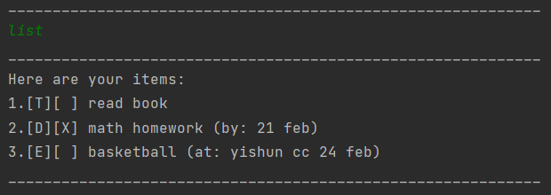
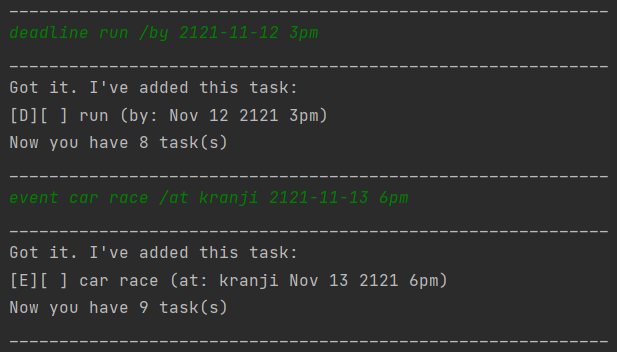

# Individual Project (iP) User Guide

This iP, also known as DUKE, is a desktop application that helps you to keep track of 3 types of tasks via a
Command Line Interface (CLI). The 3 types of tasks are:
- ToDos
- Deadlines
- Events

## Table of Contents

- [Setting Up](#setting-up)
- [Features](#features)
    - [Adding a ToDo Task: `todo`](#adding-a-todo-task-todo)
    - [Adding a Deadline Task: `deadline`](#adding-a-deadline-task-deadline)
    - [Adding an Event Task: `event`](#adding-an-event-task-event)
    - [Listing All Tasks: `list`](#listing-all-tasks-list)
    - [Setting a Task as Done: `done`](#setting-a-task-as-done-done)
    - [Deleting a Task: `delete`](#deleting-a-task-delete)
    - [Finding a Task: `find`](#finding-a-task-find)
    - [Ending the Program: `bye`](#ending-the-program-bye)
    - [Saving Tasks to Hard Drive (Automatic)](#saving-tasks-to-hard-drive-automatic)
    - [Change of Date Format (Automatic)](#change-of-date-format-automatic)
- [Command Summary](#command-summary)

## Setting Up

1. Ensure you have Java `11` installed in your computer.
2. Download the latest `ip.jar` from [here](https://github.com/AnShengLee/ip/releases).
3. Copy the file to the folder you want to use as the home folder for your DUKE.
4. Run the application by opening a command line in that folder and entering the following command: `java -jar ip.jar`.
5. Type the available commands in the command line and press Enter to execute it.
6. Refer to [Features](#features) below for details of each command.

## Features
### Note
- Words in `UPPER_CASE` are parameters to be given by the user.

### Adding a ToDo Task: `todo`
Adds a ToDo task for DUKE to keep track.

Format: `todo TASK_DESCRIPTION`

- If an empty or blank task description is given, the ToDo task will not be
  added and a warning will be given.
- Leading and trailing spaces of `TASK_DESCRIPTION` will be removed.

Example: `todo read book`

### Adding a Deadline Task: `deadline`
Adds a Deadline task for DUKE to keep track.

Format: `deadline TASK_DESCRIPTION /by DEADLINE`

- If any parameters given is empty or blank, the Deadline task will not be
  added and a warning will be given.
- Leading and trailing spaces of `TASK_DESCRIPTION` and `DEADLINE` will be removed.

Example: `deadline read book /by 21 feb`

### Adding an Event Task: `event`
Adds an Event task for DUKE to keep track.

Format: `event TASK_DESCRIPTION /at EVENT_DETAILS`

- If any parameters given is empty or blank, the Event task will not be
  added and a warning will be given.
- Leading and trailing spaces of `TASK_DESCRIPTION` and `EVENT_DETAILS` will be removed.

Example: `event read book /at 21 feb bishan library`

### Listing All Tasks: `list`
Shows a list of all tasks DUKE is currently tracking.

Format: `list`

- All the tasks shown will be indexed starting from 1.
- If there are no tasks, DUKE will inform you.

How the list will look like:

Each task has, in the following order, their index, task type, done status and the task itself. A task that is set as 
done will have an `X` just like task 2.

### Setting a Task as Done: `done`
Sets a task that DUKE is tracking as done.

Format: `done INDEX_OF_TASK`

- Sets task at specified `INDEX_OF_TASK` as done.
- The `INDEX_OF_TASK` refers to the index number shown in the displayed tasks list.
- The index must be a **positive integer** 1, 2, 3, …
- If the index of task given is out of range, nothing will happen and a warning will be given.

Example: `list` followed by `done 2` sets the second task as done.

### Deleting a Task: `delete`
Deletes a task. DUKE will then stop tracking that particular task.

Format: `delete INDEX_OF_TASK`

- Deletes the task at specified `INDEX_OF_TASK`.
- The `INDEX_OF_TASK` refers to the index number shown in the displayed tasks list.
- The index must be a **positive integer** 1, 2, 3, …
- If the index of task given is out of range, nothing will happen and a warning will be given.

Example: `list` followed by `delete 3` deletes the third task and DUKE will not track it anymore.

### Finding a Task: `find`
Finds tasks with `TASK_DESCRIPTION` that contain the given keyword.

Format: `find KEYWORD`

- The search is case-insensitive. e.g, `ball` will match `Ball`.
- Only accepts 1 keyword else a warning will be thrown.
- Leading and trailing spaces of `KEYWORD` will be removed.
- Only `TASK_DESCRIPTION` field of tasks is searched.
- Non-full words can be matched e.g., `ball` will match `football`.
- DUKE will notify you if there are no related tasks.

Example: `find ball` returns `pump ball`, `football`, `basketball` and `Ball race`

### Ending the Program: `bye`
Ends the program.

Format: `bye`

### Saving Tasks to Hard Drive (Automatic)
When DUKE starts, it looks for a data file called `DukeData.txt` and loads in all the data.

`DukeData.txt` will store 3 essential information for each task:
- Task type.
- Task done status.
- Task itself (for Deadlines and Events, this will be further split into 2 parts where the first part is
`TASK_DESCRIPTION` and the second part is `DEADLINE` or `EVENT_DETAILS`).

Task entries in `DukeData.txt` that have missing information will be considered corrupted and will not be loaded.
If there is no `DukeData.txt` file, an empty one will be created in the same folder as `ip.jar`. 

After every command input by you, all the tasks DUKE is currently tracking will be saved into `DukeData.txt` to ensure 
data integrity when DUKE crashes. If there are errors, you will be notified. No notification will be shown if there
are no errors.

Right before the program ends, another final save will be done. You will be notified if it is
a success or a failure.

### Change of Date Format (Automatic)
Dates given in the form of `yyyy-mm-dd` (e.g., 2121-11-12) will be printed in the form of `MMM dd yyyy`
(e.g., Nov 12 2121). This is done to increase readability.

This feature is only available for dates keyed in as:
- `DESCRIPTION` for Deadline tasks
- `EVENT_DETAILS` for Event tasks

Here is how it will look like:

## Command Summary

| Action | Format, Examples |
| ------------ | ------------- |
| Add ToDo | `todo TASK_DESCRIPTION`   e.g., `todo read book` |
| Add Deadline | `deadline TASK_DESCRIPTION /by DEADLINE`   e.g., `deadline read book /by 21 feb` |
| Add Event | `event TASK_DESCRIPTION /at EVENT_DETAILS`   e.g., `event read book /at 21 feb bishan library` |
| List | `list` |
| Set Done | `done INDEX_OF_TASK`   e.g., `done 2` |
| Delete | `delete INDEX_OF_TASK`   e.g., `delete 2` |
| Find | `find KEYWORD`   e.g., `find ball` |
| End | `bye` |
